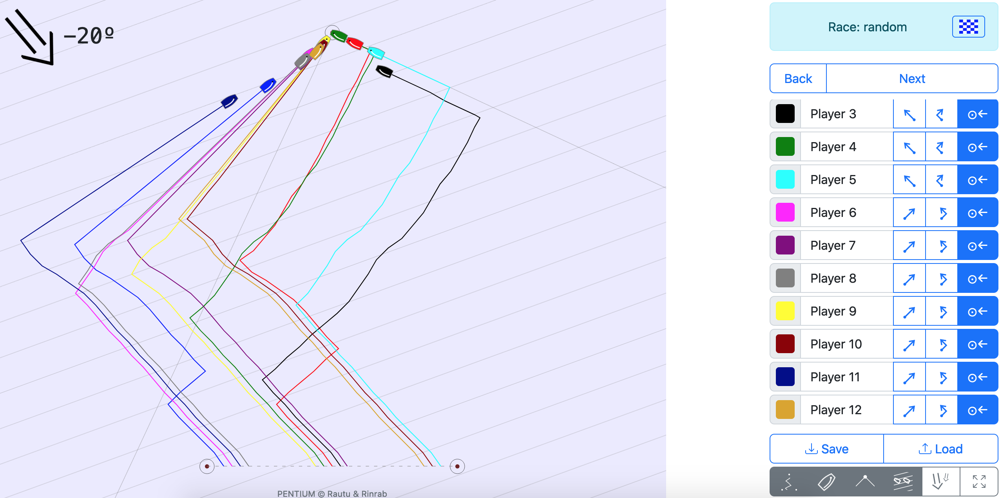

# Tactical Sail Simulator
Tactical sail simulator ([tss.boats](https://tss.boats)) is trainer for sail strategy.
This trainer made for one device. Players siting near the device
and say to coach their turns: go forward or do take. 

# Changelog
<ul type="disc">
  <li>
    
<strong>v1.1.0</strong>

    <ul type="circle">
      <li>
        
Add cup

      </li>
      <li>
        
Hotkeys to select turn of all boats to forward, tack or to mark

      </li>
    </ul>
  </li>
  <li>
    
<strong>v1.0.2</strong>

    <ul type="circle">
      <li>
        
Zoom to up mark zone

      </li>
      <li>
        
Add help

      </li>
    </ul>
  </li>
  <li>
    
<strong>v1.0.0</strong>

    <ul type="circle">
      <li>
        
Initial release.

      </li>
    </ul>
  </li>
</ul>